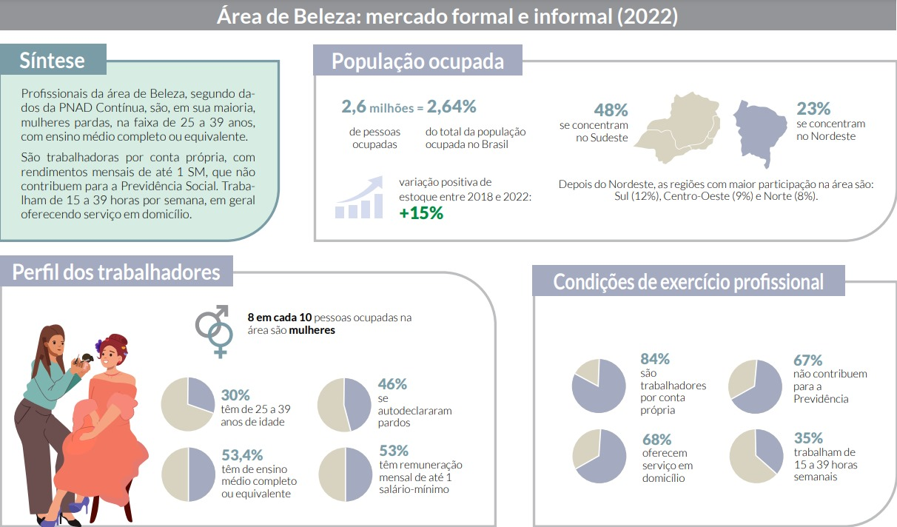

# Introdução

O AgendaGlow é um aplicativo mobile desenvolvido para Android, voltado para a otimização da gestão de salões de beleza. O contexto do projeto envolve estabelecimentos de pequeno a médio porte que enfrentam desafios na organização dos agendamentos e comunicação de equipe. O problema central identificado foi a falta de uma ferramenta prática, intuitiva e centralizada para gerenciar clientes, serviços e profissionais, evitando erros e facilitando o dia a dia das atendentes.

O objetivo do projeto é desenvolver uma solução tecnológica que aumente a eficiência e produtividade do negócio, e promova uma experiência mais organizada e profissional para o seu público alvo: atendentes, recepcionistas e gerentes de salão de beleza.

## Problema

Muitos salões de beleza enfrentam dificuldades em gerenciar seus agendamentos e manter a comunicação organizada entre atendentes e profissionais, principalmente aqueles que ainda usam métodos tradicionais, como agendas físicas ou planilhas, que podem gerar conflitos e erros de marcação, perda de informações ou sobreposição de horários.

## Objetivos

### Objetivo Geral:
Desenvolver um aplicativo mobile para Android que permita a gestão eficiente de agendamentos em salões de beleza, centralizando as informações de clientes, serviços e profissionais.

### Objetivos Específicos:
1 - Criar uma interface simples e intuitiva para uso das atendentes, que permita o cadastro e consulta de agendamentos.

2 - Reduzir erros e conflitos de horário por meio de uma organização centralizada das marcações.

3 - Permitir a inclusão de observações e informações nos agendamentos, melhorando a comunicação interna da equipe.
 
## Justificativa

A escolha em desenvolver o AgendaGlow está diretamente relacionada à relevância e crescimento constante do setor de beleza no Brasil. Logo após a pandemia, o setor contava com mais de 2,6 milhões de profissionais ocupados, representando cerca de 2,64% da população ocupada no país, sendo a maior parte deste número formada por pequenos negócios e trabalhadores autônomos (84% atuam por conta própria, em salões e barbearias de bairro, ou atendimento à domicílio).

Apesar do crescimento do setor, ainda existem grandes desafios de gestão e organização, visto que a maioria dos salões e profissionais depende de métodos manuais ou pouco integrados (como agendas físicas e planilhas), aumentando o risco de erros de marcação, perda de informações e dificuldade na comunicação da equipe, impactando na produtividade do negócio e na experiência do cliente.

Outro aspecto importante é a alta informalidade: grande parte dos profissionais não contribuem para a Previdência Social, o que evidencia a fragilidade das condições de trabalho e falta de estruturação administrativa. Nesse cenário, ferramentas tecnológicas acessíveis e de fácil uso podem contribuir para aumentar o nível de profissionalização e oferecer maior segurança para os trabalhadores do setor de beleza.

Desta maneira, o AgendaGlow se justifica como resposta a essa demanda: uma ferramenta prática, leve, intuitiva e acessível que apoia a rotina e gestão dos salões de beleza, centralizando informações, contribuindo para a modernização e fortalecendo a competitividade do setor.

Fonte: Senac, Departamento Nacional, 2024, a partir de dados da PNAD Contínua.

## Público-Alvo

Os principais usuários do AgendaGlow serão atendentes, recepcionistas e gerentes, responsáveis pela marcação de horários, relacionamento com clientes e gestão das rotinas internas.

## Características do público alvo:
- Perfil educacional: maioria possui ensino médio completo, embora exista diversidade de escolaridade
- Faixa etária: predominância entre 25 e 39 anos (49% do setor), mas com participação relevante de profissionais mais jovens (até 24 anos, 20%)
- Relação com tecnologia: utilizam smartphones no dia a dia e redes sociais como Instagram e WhatsApp para comunicação com clientes, mas geralmente carecem de ferramentas integradas para gestão.

## Hierarquia:
- Atendentes/recepcionistas → fazem marcações e lidam diretamente com clientes.
- Gerentes/donos de salões → responsáveis por supervisionar a equipe, acompanhar agendamentos e manter o negócio organizado.
- Profissionais autônomos (manicures, cabeleireiros, maquiadores, barbeiros etc.) → podem usar o sistema de forma independente para gerenciar seus próprios clientes e horários.
## Diagrama de Personas:

## Mapa de Stakeholders:

