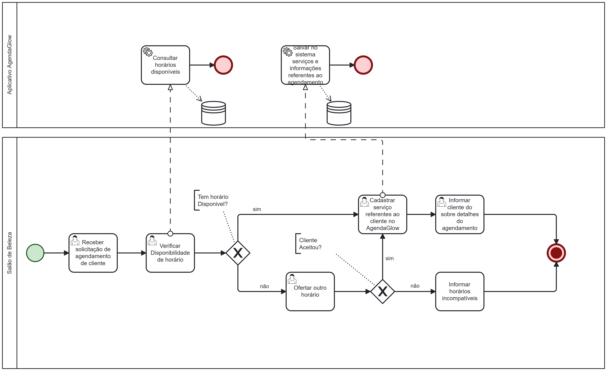
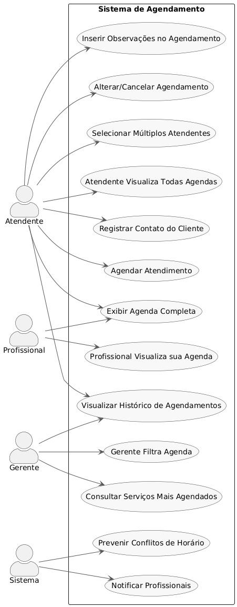

# Especificações do Projeto

Pré-requisitos: <a href="1-Documentação de Contexto.md"> Documentação de Contexto</a>

## Personas

Persona 1 – A Atendente

Juliana Ribeiro tem 27 anos, é atendente em um salão de beleza de bairro e possui ensino médio completo. Trabalha há três anos em um salão movimentado na zona urbana, onde precisa atender clientes pelo telefone e WhatsApp, organizar agendamentos e lidar com imprevistos de última hora. Muitas vezes se sente sobrecarregada quando ocorrem conflitos de horários ou quando clientes reclamam de marcações duplicadas. Apesar de usar bastante o celular e redes sociais no dia a dia, Juliana não tem experiência com softwares de gestão. Por isso, busca uma ferramenta simples e rápida que a ajude a organizar os atendimentos sem depender de planilhas ou agendas de papel.

Persona 2 – O Gerente

Ricardo Almeida tem 35 anos, é gerente e dono de um salão de beleza de médio porte. Possui ensino médio completo e fez alguns cursos livres de gestão. Administra um espaço com oito profissionais, entre cabeleireiros, manicures e maquiadores, e enfrenta como principal desafio manter a equipe organizada e a comunicação eficiente. Ricardo sente falta de relatórios claros sobre agendamentos para planejar melhor os atendimentos e reduzir cancelamentos. Pragmático, ele procura soluções tecnológicas acessíveis, que não exijam muito treinamento e que tragam mais profissionalismo e organização ao seu negócio.

Persona 3 – A Profissional Autônoma

Camila Souza tem 23 anos, é manicure autônoma e possui ensino fundamental completo, com cursos profissionalizantes. Atende clientes em sua própria casa e também em domicílio. Atualmente organiza seus compromissos em um caderno e se comunica com clientes pelo WhatsApp, mas frequentemente esquece horários ou acaba marcando dois atendimentos no mesmo período. Camila busca passar uma imagem mais profissional e tornar seu dia a dia mais prático. Para isso, deseja utilizar uma ferramenta que permita registrar seus compromissos de forma confiável, incluindo observações e informações importantes sobre cada cliente.

## Histórias de Usuários

Com base na análise das personas forma identificadas as seguintes histórias de usuários:

## Agendamento
| EU COMO... (Persona)    | QUERO/PRECISO... (Funcionalidade)                                               | PARA... (Motivo/Valor)                                               |
| ----------------------- | ------------------------------------------------------------------------------- | -------------------------------------------------------------------- |
| Atendente/Recepcionista | Cadastrar um novo agendamento com nome da cliente, serviço, atendente e horário | Garantir que o atendimento seja organizado e registrado corretamente |
| Atendente/Recepcionista | Inserir observações específicas no agendamento                                  | Informar detalhes importantes sobre a cliente ou serviço             |
| Atendente/Recepcionista | Editar ou cancelar um agendamento já feito                                      | Corrigir erros ou ajustar conforme solicitações da cliente           |
| Atendente/Recepcionista | Selecionar mais de um atendente responsável no agendamento                      | Permitir que serviços combinados sejam registrados de forma clara    |

## Gestão e Administração
| EU COMO... (Persona) | QUERO/PRECISO... (Funcionalidade)                      | PARA... (Motivo/Valor)                             |
| -------------------- | ------------------------------------------------------ | -------------------------------------------------- |
| Gerente/Dona         | Visualizar a agenda completa do dia/semana             | Acompanhar a movimentação e ocupação do salão      |
| Gerente/Dona         | Consultar serviços mais agendados                      | Identificar demandas e planejar equipe e estoque   |
| Gerente/Dona         | Ter acesso ao histórico de agendamentos                | Analisar recorrência e fidelização de clientes     |

## Consulta de Agenda
| EU COMO... (Persona)    | QUERO/PRECISO... (Funcionalidade)              | PARA... (Motivo/Valor)                      |
| ----------------------- | ---------------------------------------------- | ------------------------------------------- |
| Profissional do salão   | Visualizar apenas meus horários e atendimentos | Me organizar para atender minhas clientes   |
| Atendente/Recepcionista | Visualizar agenda de todos os profissionais    | Saber a disponibilidade antes de marcar     |
| Gerente/Dona            | Filtrar agenda por profissional ou serviço     | Ter uma visão clara e rápida das atividades |

## Organização e Comunicação Interna
| EU COMO... (Persona)    | QUERO/PRECISO... (Funcionalidade)                         | PARA... (Motivo/Valor)                                     |
| ----------------------- | --------------------------------------------------------- | ---------------------------------------------------------- |
| Atendente/Recepcionista | Registrar informações de contato da cliente (opcional)    | Facilitar comunicação em caso de alterações                |
| Profissional do salão   | Receber informações sobre alterações em meus atendimentos | Evitar desencontros e atrasos                              |
| Gerente/Dona            | Garantir que o sistema reduza conflitos de horário        | Melhorar a experiência da cliente e a eficiência da equipe |

## Modelagem do Processo de Negócio 

### Análise da Situação Atual

Atualmente, muitos salões de beleza realizam o agendamento de serviços por meio de agendas físicas, cadernos ou planilhas eletrônicas. Esses métodos manuais apresentam diversas limitações:

- Alto risco de erros de marcação, como duplicidade de horários ou sobreposição de atendimentos.

- Dificuldade em realizar alterações ou cancelamentos, o que pode gerar desorganização e perda de informações.

- Falta de rastreabilidade: não há registro confiável sobre quem realizou ou alterou cada agendamento.

- Comunicação interna falha, já que os profissionais do salão nem sempre têm acesso imediato às atualizações de agenda.

Esses problemas comprometem a produtividade da equipe, a organização do salão e a experiência das clientes.
### Descrição Geral da Proposta

A proposta consiste no desenvolvimento do AgendaGlow, um aplicativo mobile que centraliza e organiza os agendamentos do salão de beleza.

O sistema está diretamente alinhado às estratégias do negócio, que busca oferecer um atendimento exclusivo, organizado e humanizado. Ele se conecta aos objetivos de:

- Aumentar a eficiência operacional, reduzindo falhas nos processos de marcação.

- Melhorar a comunicação interna, permitindo que atendentes, gerentes e profissionais acessem a agenda em tempo real.

- Garantir experiência diferenciada ao cliente, com atendimento pontual e personalizado.

Oportunidades de melhoria:

- Eliminação de registros manuais suscetíveis a erros.

- Maior transparência e rastreabilidade em alterações.

- Acesso centralizado para toda a equipe.

- Agilidade na tomada de decisão do gerente ou proprietário.

### Processo 1 – Agendamento de serviço

- Reduzir a chance de marcações duplicadas.
- Facilitar alteração/cancelamento com rastreabilidade.
- Garantir que profissionais consultem seus horários em tempo real.
- Registrar observações e detalhes importantes no momento da marcação.

## Indicadores de Desempenho

| **Indicador**                            | **Objetivo**                                             | **Descrição**                                               | **Cálculo**                                       | **Fonte dados**              | **Perspectiva**    |
| ---------------------------------------- | -------------------------------------------------------- | ----------------------------------------------------------- | ------------------------------------------------- | ---------------------------- | ------------------ |
| **Taxa de Ocupação das Cadeiras**        | Avaliar se os profissionais estão sendo bem aproveitados | Mede o percentual de tempo que as cadeiras ficaram ocupadas | (Horas ocupadas ÷ Horas disponíveis) \* 100       | Agenda/Calendário do salão   | Processos Internos |
| **Faturamento por Serviço**              | Identificar quais serviços trazem mais receita           | Mede quanto cada serviço contribui para o faturamento total | (Receita do serviço ÷ Receita total) \* 100       | Sistema de caixa ou planilha | Financeira         |
| **Retorno de Clientes (Fidelização)**    | Acompanhar fidelidade dos clientes                       | Percentual de clientes que retornam após a 1ª visita        | (Clientes que retornaram ÷ Clientes novos) \* 100 | Cadastro de clientes         | Clientes           |
| **Ticket Médio por Cliente**             | Aumentar o valor médio gasto por cliente                 | Valor médio que cada cliente gasta por visita               | (Faturamento total ÷ Nº de clientes atendidos)    | Sistema de caixa             | Financeira         |
| **Taxa de Não Comparecimento (No-show)** | Reduzir faltas e melhorar o agendamento                  | Percentual de clientes que marcaram e não compareceram      | (Faltas ÷ Total de agendamentos) \* 100           | Agenda/Calendário            | Processos Internos |

## Requisitos

As tabelas que se seguem apresentam os requisitos funcionais e não funcionais que detalham o escopo do projeto. Para determinar a prioridade de requisitos, aplicar uma técnica de priorização de requisitos e detalhar como a técnica foi aplicada.

### Requisitos Funcionais

| ID     | Descrição do Requisito                                                                                  | Prioridade |
| ------ | ------------------------------------------------------------------------------------------------------- | ---------- |
| RF-001 | O sistema deve permitir que o gerente cadastre um novo funcionário gerente ou atendente (nome, cargo, email, contato)          | ALTA       |
| RF-002 | O sistema deve permitir que o gerente cadastre os serviços oferecidos pelo salão                  | ALTA      |
| RF-003 | O sistema deve permitir que um usuário cadastre um novo agendamento informando o cliente, serviço e horário  | ALTA       |
| RF-004 | O sistema deve permitir que um usuário cancele ou altere um agendamento                                 | ALTA      |
| RF-005 | O sistema deve permitir que um usuário atendente altere os próprios dados de seu cadastro               | MÉDIA       |
| RF-006 | O sistema deve permitir que o gerente associe um novo usuário ao seu login do Google                    | MÉDIA      |
| RF-007 | O sistema deve permitir que um usuário filtre os próximos agendamentos por data, cliente, serviço ou atendente                     | MÉDIA      |
| RF-008 | O sistema deve permitir que o gerente filtre os procedimentos já realizados por data, serviço, cliente ou atendente responsável                  | MÉDIA       |
| RF-009 | O sistema deve notificar o usuário quando houver um agendamento próximo (30 minutos)                    | MÉDIA       |
| RF-010 | O sistema deve notificar o cliente via Whatsapp sobre seu agendamento próximo (30 minutos)              | BAIXA       |
| RF-011 | O sistema deve notificar o cliente via Whatsapp sobre um novo agendamento                               | BAIXA       |
| RF-012 | O sistema deve permitir registrar informações de contato do cliente (telefone, e-mail, WhatsApp)        | ALTA        |
| RF-013 | O sistema deve permitir que o gerente emita um relatório em PDF a partir dos filtros de procedimentos já realizados                                 | MÉDIA       |

### Requisitos não Funcionais

| ID      | Descrição do Requisito                                                                                        | Prioridade |
| ------- | ------------------------------------------------------------------------------------------------------------- | ---------- |
| RNF-001 | A interface deve ser simples e intuitiva, adequada para usuários com pouca familiaridade com tecnologia       | ALTA       |
| RNF-002 | O sistema deve ser disponibilizado como aplicativo Android                                                    | ALTA       |
| RNF-003 | O carregamento da agenda diária ou semanal deve ocorrer em até 3 segundos                                     | MÉDIA      |
| RNF-004 | O sistema deve evitar marcações duplicadas e garantir consistência nos agendamentos                           | ALTA       |
| RNF-005 | Os dados de clientes devem ser armazenados de forma segura, em conformidade com a LGPD                        | ALTA       |
| RNF-006 | Alterações em agendamentos devem gerar notificações em tempo real para os profissionais envolvidos            | ALTA       |
| RNF-007 | O sistema deve ser legível e funcional em diferentes tamanhos de tela (smartphones e tablets)                 | MÉDIA      |
| RNF-008 | O sistema deve estar disponível 24h por dia, salvo períodos de manutenção programada                          | MÉDIA      |
| RNF-009 | O código deve ser modular para permitir futuras expansões (ex.: relatórios financeiros e controle de estoque) | MÉDIA      |
| RNF-010 | O sistema deve ser compatível com versões do Android a partir da 8.0 (Oreo)                                   | BAIXA      |

## Restrições

O projeto está restrito pelos itens apresentados na tabela a seguir.

| ID | Restrição                                                                   |
| -- | --------------------------------------------------------------------------- |
| 01 | O projeto deverá ser entregue até o final do semestre                       |
| 02 | Não pode ser desenvolvido um módulo de backend complexo (somente local)     |
| 03 | O sistema será desenvolvido apenas para Android (não contemplará iOS)       |
| 04 | O aplicativo deverá ser implementado em linguagem compatível com Android    |
| 05 | O desenvolvimento será realizado por uma equipe reduzida (apenas acadêmica) |

## Diagrama de Casos de Uso

# Matriz de Rastreabilidade
| ID      | Descrição do Requisito                                                                   | Tipo          | Prioridade | Relacionamentos (Casos de Uso / Restrições) |
| ------- | ---------------------------------------------------------------------------------------- | ------------- | ---------- | ------------------------------------------- |
| RF-001  | Permitir cadastrar um novo agendamento com nome do cliente, serviço, atendente e horário | Funcional     | ALTA       | UC01 - Cadastrar Agendamento / R01, R02     |
| RF-002  | Permitir inserir observações específicas em cada agendamento                             | Funcional     | MÉDIA      | UC02 - Inserir Observações                  |
| RF-003  | Permitir editar ou cancelar um agendamento existente                                     | Funcional     | ALTA       | UC03 - Editar/Cancelar Agendamento          |
| RF-004  | Permitir selecionar mais de um atendente responsável por um agendamento                  | Funcional     | MÉDIA      | UC04 - Selecionar Atendentes                |
| RF-005  | Exibir a agenda completa por dia e semana                                                | Funcional     | ALTA       | UC05 - Visualizar Agenda                    |
| RF-006  | Permitir consultar os serviços mais agendados                                            | Funcional     | MÉDIA      | UC06 - Consultar Relatórios                 |
| RF-007  | Disponibilizar histórico de agendamentos com filtro por cliente e período                | Funcional     | MÉDIA      | UC07 - Histórico de Agendamentos            |
| RF-008  | Permitir que profissionais visualizem apenas seus próprios atendimentos                  | Funcional     | ALTA       | UC08 - Visualização Restrita                |
| RF-009  | Permitir que atendentes visualizem a agenda de todos os profissionais                    | Funcional     | ALTA       | UC09 - Agenda Geral                         |
| RF-010  | Permitir que gerentes filtrem agenda por profissional ou serviço                         | Funcional     | MÉDIA      | UC10 - Filtro de Agenda                     |
| RF-011  | Permitir registrar informações de contato do cliente (telefone, e-mail, WhatsApp)        | Funcional     | MÉDIA      | UC11 - Cadastro de Contatos                 |
| RF-012  | Notificar profissionais sobre alterações nos agendamentos                                | Funcional     | ALTA       | UC12 - Notificação                          |
| RF-013  | Implementar mecanismos de prevenção de conflitos de horário                              | Funcional     | ALTA       | UC13 - Prevenção de Conflitos               |
| RNF-001 | A interface deve ser simples e intuitiva                                                 | Não Funcional | ALTA       | Usabilidade / R05                           |
| RNF-002 | O sistema deve ser disponibilizado como aplicativo Android                               | Não Funcional | ALTA       | Plataforma / R03, R04                       |
| RNF-003 | O carregamento da agenda deve ocorrer em até 3 segundos                                  | Não Funcional | MÉDIA      | Performance                                 |
| RNF-004 | O sistema deve evitar marcações duplicadas e garantir consistência nos agendamentos      | Não Funcional | ALTA       | Integridade / RF-013                        |
| RNF-005 | Os dados de clientes devem ser armazenados de forma segura (LGPD)                        | Não Funcional | ALTA       | Segurança                                   |
| RNF-006 | Alterações em agendamentos devem gerar notificações em tempo real                        | Não Funcional | ALTA       | RF-012                                      |
| RNF-007 | O sistema deve ser legível e funcional em diferentes tamanhos de tela                    | Não Funcional | MÉDIA      | Usabilidade                                 |
| RNF-008 | O sistema deve estar disponível 24h por dia, salvo períodos de manutenção                | Não Funcional | MÉDIA      | Confiabilidade                              |
| RNF-009 | O código deve ser modular para permitir futuras expansões                                | Não Funcional | MÉDIA      | Manutenibilidade                            |
| RNF-010 | O sistema deve ser compatível com versões Android a partir da 8.0                        | Não Funcional | BAIXA      | Plataforma / R03                            |
| R01     | O projeto deverá ser entregue até o final do semestre                                    | Restrição     | -          | Impacta todos os requisitos                 |
| R02     | Não pode ser desenvolvido backend complexo (somente local)                               | Restrição     | -          | RF-001, RF-003, RF-005                      |
| R03     | O sistema será desenvolvido apenas para Android (não contemplará iOS)                    | Restrição     | -          | RNF-002, RNF-010                            |
| R04     | O aplicativo deverá ser implementado em linguagem compatível com Android                 | Restrição     | -          | RNF-002                                     |
| R05     | O desenvolvimento será realizado por equipe reduzida (apenas acadêmica)                  | Restrição     | -          | RNF-001                                     |

# Gerenciamento de Projeto

De acordo com o PMBoK v6 as dez áreas que constituem os pilares para gerenciar projetos, e que caracterizam a multidisciplinaridade envolvida, são: Integração, Escopo, Cronograma (Tempo), Custos, Qualidade, Recursos, Comunicações, Riscos, Aquisições, Partes Interessadas. Para desenvolver projetos um profissional deve se preocupar em gerenciar todas essas dez áreas. Elas se complementam e se relacionam, de tal forma que não se deve apenas examinar uma área de forma estanque. É preciso considerar, por exemplo, que as áreas de Escopo, Cronograma e Custos estão muito relacionadas. Assim, se eu amplio o escopo de um projeto eu posso afetar seu cronograma e seus custos.

## Gerenciamento de Tempo

Com diagramas bem organizados que permitem gerenciar o tempo nos projetos, o gerente de projetos agenda e coordena tarefas dentro de um projeto para estimar o tempo necessário de conclusão.

O gráfico de Gantt ou diagrama de Gantt também é uma ferramenta visual utilizada para controlar e gerenciar o cronograma de atividades de um projeto. Com ele, é possível listar tudo que precisa ser feito para colocar o projeto em prática, dividir em atividades e estimar o tempo necessário para executá-las.

## Gerenciamento de Equipe

O gerenciamento adequado de tarefas contribuirá para que o projeto alcance altos níveis de produtividade. Por isso, é fundamental que ocorra a gestão de tarefas e de pessoas, de modo que os times envolvidos no projeto possam ser facilmente gerenciados. 

## Gestão de Orçamento

O processo de determinar o orçamento do projeto é uma tarefa que depende, além dos produtos (saídas) dos processos anteriores do gerenciamento de custos, também de produtos oferecidos por outros processos de gerenciamento, como o escopo e o tempo.

