# Projeto de Interface

O protótipo desenvolvido apresenta as principais telas e fluxos do sistema, permitindo visualizar de forma clara como o usuário interage com as funcionalidades da plataforma. O design foi estruturado para oferecer navegação simples, intuitiva e coerente com os requisitos levantados.

As telas contemplam:

- **Login** – autenticação do usuário para acesso seguro.  
- **Início** – visão geral com resumo de dados e atalhos rápidos.  
- **Agenda** – gerenciamento dos agendamentos.  
- **Clientes** – cadastro e consulta de clientes.  
- **Mais/ADM/Funcionario** – acesso a outros serviços, relatórios e equipe.  
- **Cadastros** – formulários específicos para agendamento, serviços e funcionários.  
- **Serviços e Relatórios** – listagem de serviços e geração de relatórios de histórico.  
- **Alterar Dados** – edição de informações do usuário.  

## Diagrama de Fluxo

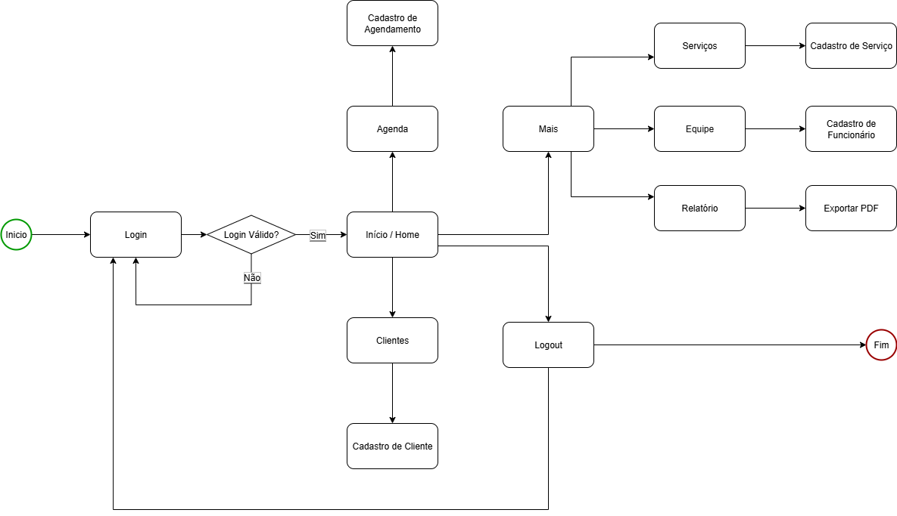

## Wireframes

  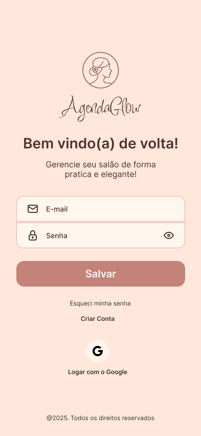
  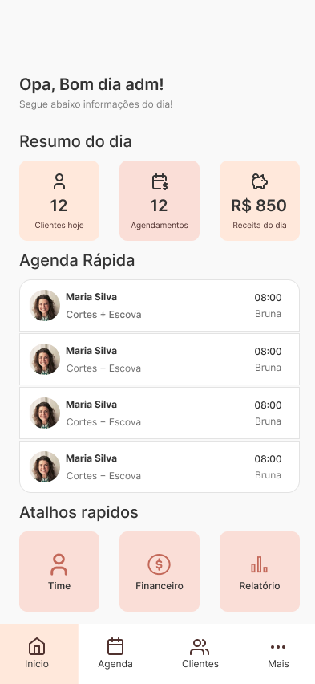
  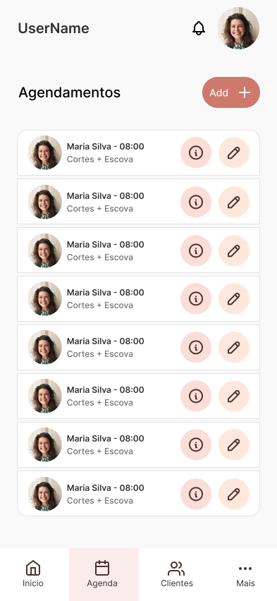

  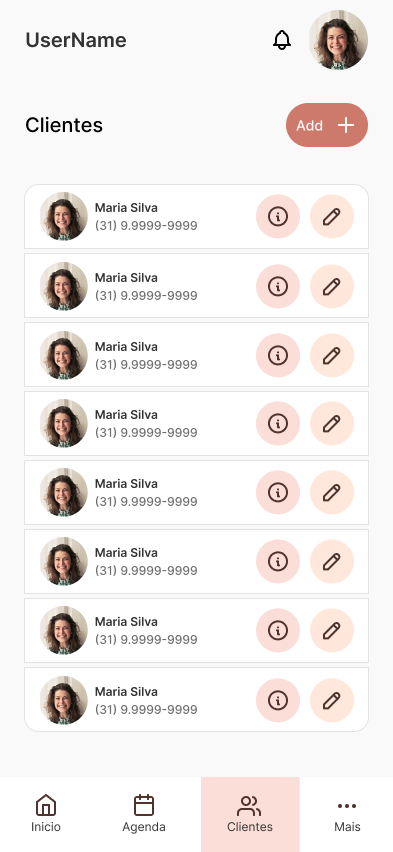
  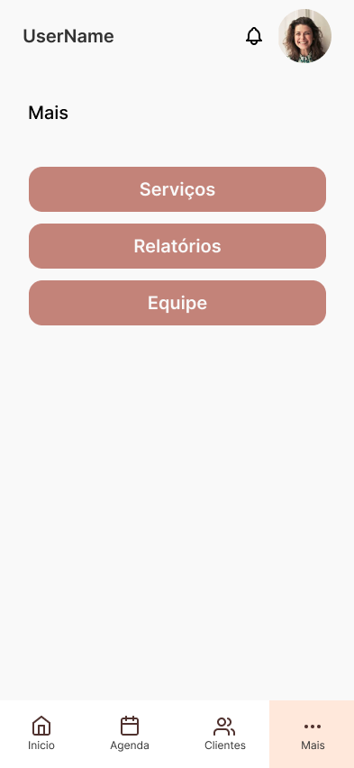
  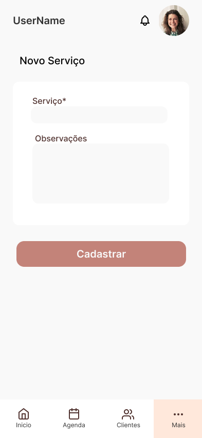

  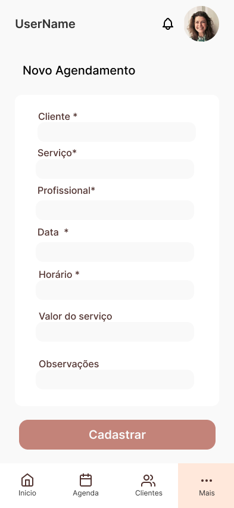
  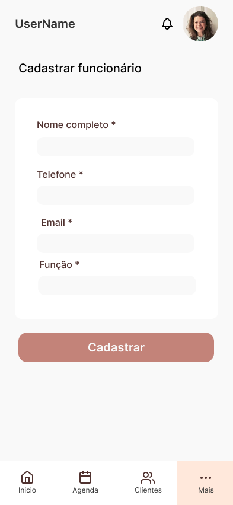
  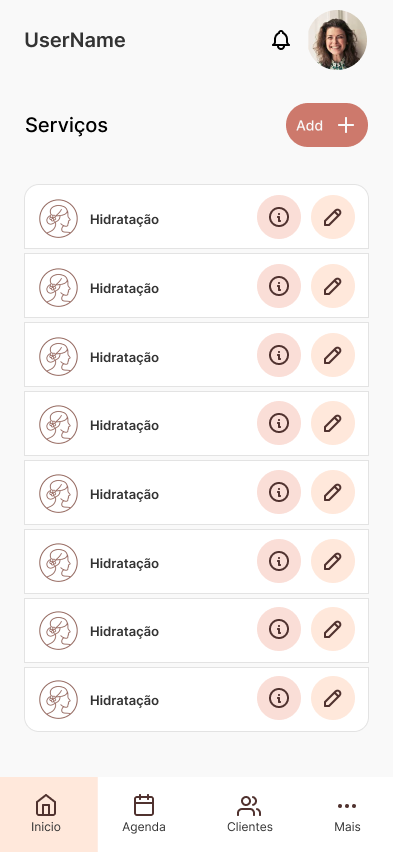

  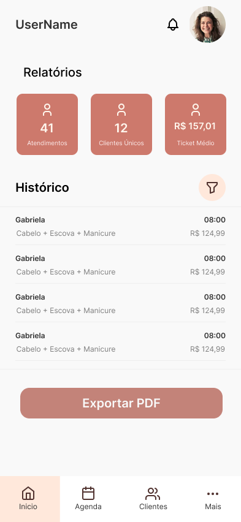
  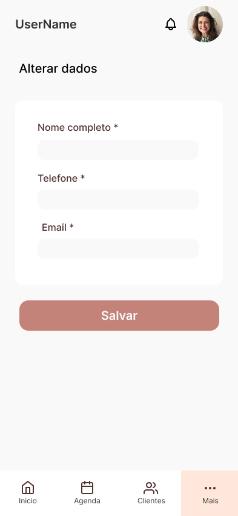

### Protótipo Interativo
[Clique aqui para acessar os protótipos](https://www.figma.com/design/SZaZNk9k6hhm9TGGcDOgEn/AgendaGlow?node-id=0-1&p=f)
